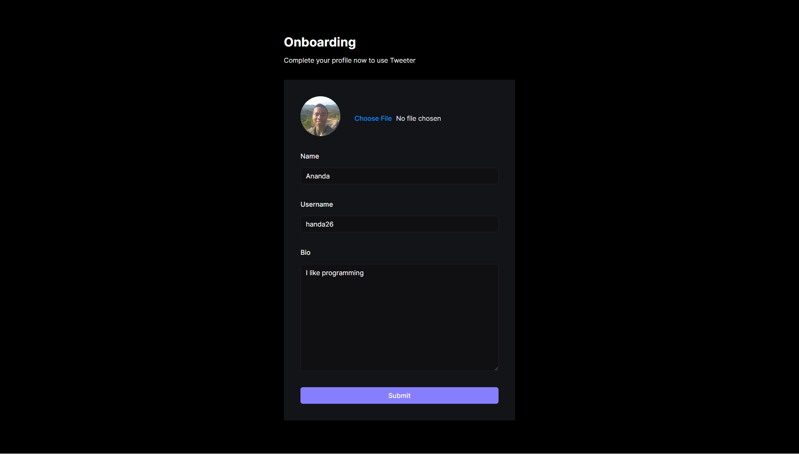
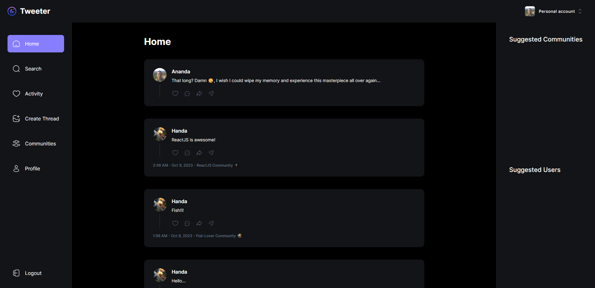
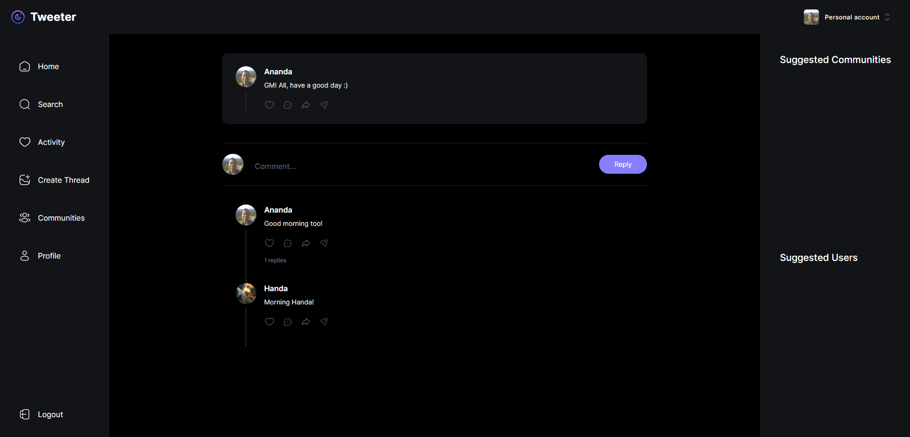
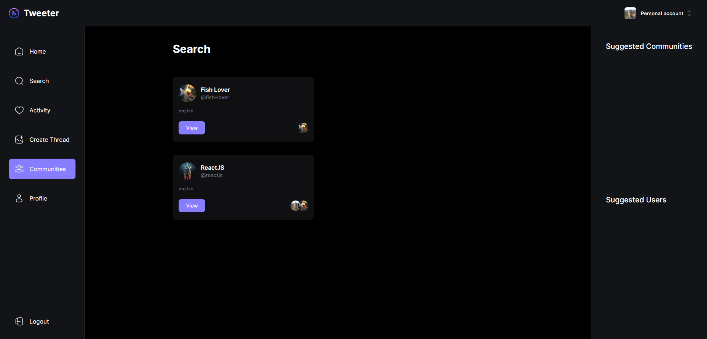

# Tweeter 

## Contents

- [Description](#description)
- [Features](#features)
- [Installation](#installation-for-development)
- [Tech Stack](#tech-stack)
- [Screenshoots](#screenshoots)
- [Tweeter](#tweeter)

## Description

Tweeter is a Twitter clone web application that brings the essence of Twitter to your fingertips. Built with Next.js, Tailwind CSS, Node.js/Express.js, and MongoDB/Mongoose, Tweeter offers a familiar Twitter-like experience with a twist. It leverages Clerk for user and community management and uses shadcn/ui for form templates.

## Features

### User Onboarding

When a new user signs up, Tweeter ensures a smooth onboarding experience. Users can set their profile image, name, username, and add a bio to personalize their profiles.

### Create Posts

Users have the ability to create posts both as individual users and community members. They can create communities and invite other members via email.

### Post Replies

Tweeter allows users to engage with each other by replying to posts. This feature fosters conversations and interactions among users.

### Notifications

Receive notifications when other users reply to your posts. Stay updated and engaged with your audience.

## Installation for Development

Use the package manager [npm](https://www.npmjs.com/get-npm) to install all required dependecies.
```bash
npm install
```
and then:
```bash
npm run dev
```

## Tech Stack

- **Frontend**:
  - Framework: Next.js
  - Styling: Tailwind CSS
  - UI Library: shadcn/ui (for form templates)
  - Authentication: Clerk (supports GitHub and Google login)

- **Backend**:
  - Server: Node.js/Express.js
  - Database: MongoDB with Mongoose

## Screenshoots

<div align="center">
    
    
    
    
</div>

## Demo Crowdfunding Page

Let's try it.

<a href="https://car-showcase-henna.vercel.app/" target="_blank">
  
</a>
